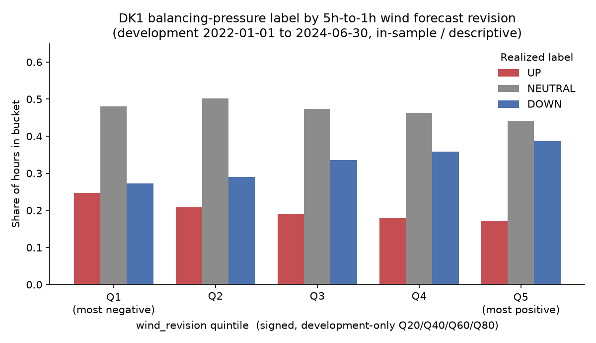

# DK1 Short-Term Power Market Research

Independent, point-in-time research into whether renewable forecast revisions and observable system conditions contain information about short-term balancing pressure in DK1.

## Current Status

**Level A (CV-safe) is achieved.** The foundation, official-source validation,
the development data pipeline, the frozen target and one pre-registered
hypothesis test are complete. Level B is next.

- Repository structure and GitHub remote: created
- Python environment: created and verified
- Data validation: P1 complete; source roles and point-in-time eligibility inventoried
- Data pipeline: P2 complete; bounded acquisition, raw provenance, timestamp
  normalization, hourly joins and quality gates passed
- Target construction: P3 complete; the balancing spread, development-only
  Q25 neutral band, three outcome labels and baseline contracts are frozen
- Hypothesis testing: H2 round 1 complete — pre-registered, then run once;
  result **supported but weak** (see below)
- Level A (CV-safe): **achieved** (all ten criteria audited, P8.1)
- Locked holdout: unused

## Research Question

> Do renewable forecast revisions and observable system fundamentals contain information about short-term balancing pressure in DK1, and under what conditions does that relationship break down?

## Primary Target

For each hourly DK1 delivery period:

`Spread_t = RegulatingBalancePowerdata.ImbalancePriceEUR_t - Elspotprices.SpotPriceEUR_t`

The DK1 day-ahead reference is fixed as `SpotPriceEUR` and the historical
balancing outcome as `ImbalancePriceEUR`, both in EUR/MWh. The balancing source
has one documented missing development hour and is used as an ex-post research
outcome rather than an executable trading price.

The frozen development-only neutral-band threshold is `5.9956075 EUR/MWh`.
Valid target labels are `UP` above `+delta`, `DOWN` below `-delta`, and
`NEUTRAL` on both boundaries and between them.

## Research Periods

- Development period: 2022-01-01 to 2024-06-30
- Locked holdout: 2024-07-01 to 2024-12-31

The holdout must not be accessed before the Level C unlock requirements are satisfied.

## Validated Source Roles

- Renewable fixed-horizon forecasts: `Forecasts_Hour`, conditionally eligible
  subject to the P2.3 decision-cutoff contract
- Day-ahead reference: `Elspotprices.SpotPriceEUR`, validated across all
  21,887 development hours
- Balancing outcome: `RegulatingBalancePowerdata.ImbalancePriceEUR`, with one
  documented missing development hour preserved
- Actual residual load and realized exchange:
  `ProductionConsumptionSettlement`, complete but diagnostic only because it
  is settlement data published after delivery
- Day-ahead cross-border capacity and schedule: `Transmissionlines`,
  conditional candidates with border-specific null/sign rules still required
- Countertrade: partial-period conditional candidate; historical versions are
  not fully reconstructable
- H1-B historical load forecast: external ENTSO-E candidate pending access and
  timing evidence

The P1.4 evidence, raw-file hashes and machine-readable eligibility inventory
are preserved in [`research/evidence/p1_4_sources`](research/evidence/p1_4_sources/README.md).

## Development Data Pipeline

P2 produces a local, git-ignored hourly development table at
`data/processed/p2/hourly_base_development.parquet`. It contains 21,887 unique
DK1 delivery hours and preserves the documented single balancing-source gap.
The committed audit evidence is under
[`research/evidence/p2_data_pipeline`](research/evidence/p2_data_pipeline/README.md).

- The API client rejects dates outside development and rejects non-DK1 requests
  before contacting the source.
- Raw JSON responses remain immutable; request details, retrieval times and
  SHA-256 hashes provide provenance.
- UTC is the join key; Danish local time, UTC offset and repeated-hour order are
  retained for DST interpretation.
- The decision cutoff is the last information snapshot before delivery starts.
  Fixed 5h/1h forecasts qualify under the official pre-delivery availability
  rule, while outcomes and settlement actuals remain quarantined.
- P2 does not calculate spread, labels or forecast revisions. Those begin in P3
  and P4.

Rebuild the local P2 outputs with:

```bash
uv run python src/p2_pipeline.py
```

## Target Construction

P3 produces a local, git-ignored target table at
`data/processed/p3/target_development.parquet`. It retains all 21,887 P2 hours,
adds the same-hour balancing spread and assigns 21,886 valid labels while
preserving the documented missing balancing outcome as a missing target.
Committed evidence is under
[`research/evidence/p3_target_construction`](research/evidence/p3_target_construction/README.md).

- `Spread = ImbalancePriceEUR - SpotPriceEUR`, using DK1 EUR/MWh prices for the
  same delivery hour
- `delta = 5.9956075 EUR/MWh`, the linear Q25 of 15,392 nonzero absolute
  development spreads; 6,494 observed zero spreads are excluded from the
  quantile population and later labelled NEUTRAL
- Development labels: 4,354 UP, 7,190 DOWN and 10,342 NEUTRAL, plus one missing
  label at the preserved source gap
- The majority baseline is fit on training labels only. The frozen persistence
  formula is retained as an ex-post reference because historical publication
  delay is undocumented.
- An hour-of-week training-majority baseline is registered as an
  availability-safe supplemental reference for later chronological evaluation.

Rebuild and validate the local P3 target with:

```bash
uv run python src/p3_target.py
```

## H2 — First Hypothesis Test

The primary hypothesis (H2) asks whether the 5h-to-1h renewable forecast
revision carries information about the direction of balancing pressure. The
round-1 test was **pre-registered in full** — variable, expected direction,
buckets, statistic, baselines and the pass/fail bar were fixed before the
revision variable was crossed with any outcome
([`research/hypotheses.md`](research/hypotheses.md),
[evidence](research/evidence/p4_h2_revision/README.md)).

- **Revision variable (P4.2):** `wind_revision = (Offshore + Onshore)
  (Forecast1Hour - Forecast5Hour)`, MWh, same delivery hour, non-null pairs
  only. Available for 21,615 of 21,887 development hours. The wind forecast is
  revised in essentially every hour, so the variable carries real information.
- **Result (P4.3), in-sample / descriptive:** **supported, but a weak and
  asymmetric effect.** As the wind revision goes from most negative to most
  positive, `P(DOWN)` rises from 27.3% to 38.7% and `P(UP)` falls from 24.7% to
  17.2%, monotonically across all five revision quintiles — the predicted
  mechanism. The rank association is real but small (Spearman -0.10, 95%
  bootstrap CI [-0.11, -0.08]). A transparent threshold rule beats the
  availability-safe baselines on balanced accuracy and macro-F1 but not on plain
  accuracy, and trails the ex-post persistence reference; its directional skill
  is real on the `DOWN` side and essentially absent on the `UP` side.
- **Solar** revisions show the same direction, weaker, and are reported
  separately as "conditionally supported — solar only, needs replication".
- This is not a deployable or profitable rule. A chronological out-of-sample
  check, a stricter baseline gate and regime / cross-border conditioning are the
  Level B work.



Reproduce with:

```bash
uv run python src/p4_revision.py   # build revisions, freeze buckets
uv run python src/p4_test.py       # run the pre-registered round-1 test
```

## Research Principles

- Use only information available at the simulated decision time.
- Keep the development period separate from the locked holdout.
- Test market mechanisms before increasing model complexity.
- Preserve failed and null hypotheses.
- Treat No Trade as a valid decision.
- Do not present balancing-pressure classification as executable trading P&L.
